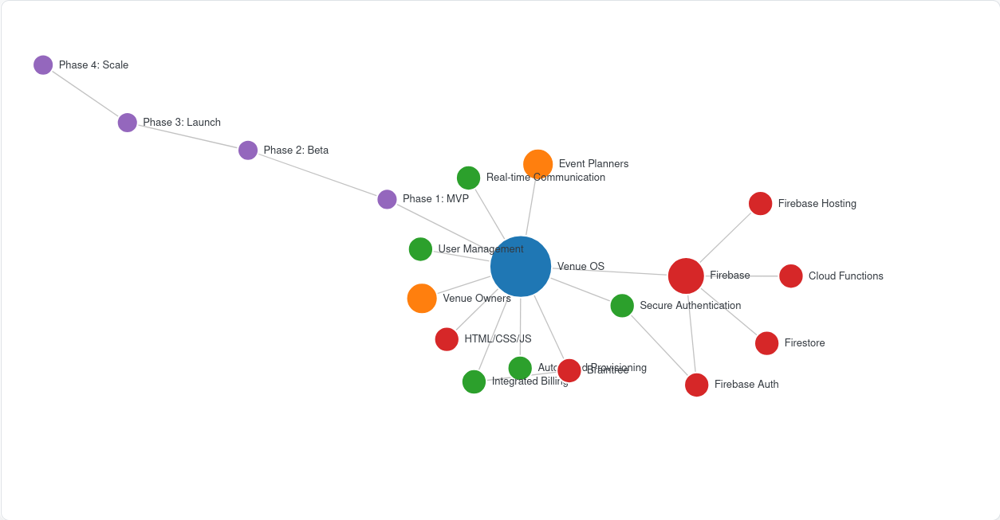
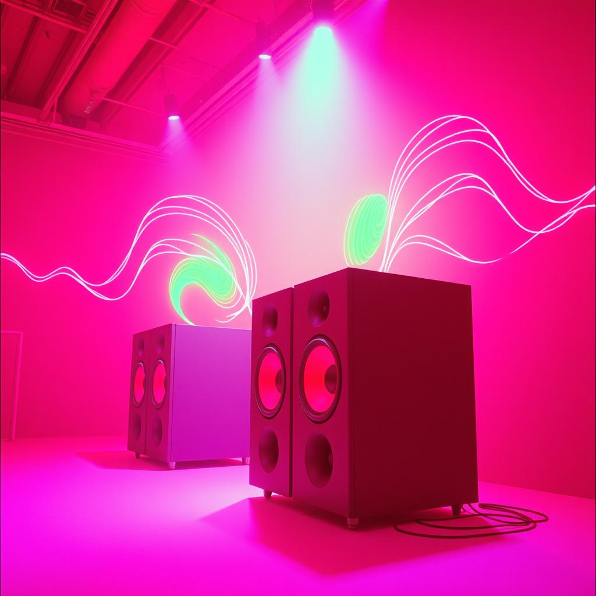

# VenuOS ---> VenosCSA...

# Venue Operating System (Venue OS) [Wire Bae and Venu OS Dohno or Support Fund](https://ko-fi.com/kastcade/goal?g=12)

like subscribe, follow, contrib... all good..


## Overview

Venue OS is a comprehensive SaaS platform designed to be the central nervous system for event venues. The project began with the goal of automating the complex setup and provisioning process for new venues, and has evolved into a full-scale business platform. Our mission is to streamline operations, from initial client booking to day-to-day management, by connecting all the necessary systems through a single, seamless workflow.

This platform will serve a two-sided market:
1.  **Venue Owners:** Who get powerful tools to manage their spaces, staff, and automation.
2.  **Event Planners & Clients:** Who get a portal to discover, book, and interact with venues.

## Current Status

**Last Updated:** August 1, 2025

The project is currently in **Phase 1: Minimum Viable Product (MVP)**. The core focus is on building the foundational infrastructure and the primary feature of adding a new venue to the system. The first active development task is Ticket #001, which involves scaffolding the project and integrating core services.

## Core Features & Vision

* **Automated Provisioning:** The system's core is a trigger-and-action workflow. Adding a new venue to the database will automatically kick off downstream processes.
* **User Management:** Automatically create and manage user accounts for venue staff in connected systems.
* **Application Integration:** Configure access and settings for essential business applications like CRMs or POS systems.
* **Secure Authentication:** A robust login system for all users, powered by Firebase Authentication.
* **Integrated Billing:** Tiered subscription management via Braintree.
* **Real-time Communication:** In-app chat for venues to communicate with their staff or clients.

## Technology Stack

This project is built on a modern, serverless architecture to ensure scalability and security.

* **Backend:**
    * **Platform:** Firebase
    * **Database:** Firestore for real-time data storage.
    * **Business Logic:** Cloud Functions for serverless backend code.
    * **Authentication:** Firebase Authentication for secure user logins.
* **Frontend:**
    * **Framework:** Vanilla HTML, CSS, and JavaScript.
    * **Hosting:** Firebase Hosting for fast, secure delivery.
* **Billing:** Braintree
* **Code Repository:** Private GitHub Repository

## Getting Started

To get a local copy up and running, follow these steps.

### Prerequisites

* Node.js and npm
* Firebase CLI (`npm install -g firebase-tools`)
* Access to the project's private GitHub repository.
* A Firebase service account key file (provided by the project admin).
* Sandbox API keys for Braintree.

### Installation

1.  Clone the repo:
    ```sh
    git clone [repo-url]
    ```
2.  Install NPM packages for the Cloud Functions:
    ```sh
    cd functions && npm install
    ```
3.  Configure your local Firebase environment:
    ```sh
    firebase use [project-id]
    ```

## Project Roadmap

1.  **Phase 1: MVP (Q3 2025):** Build the core venue creation and automation workflow.
2.  **Phase 2: Closed Beta (Q4 2025 - Q1 2026):** Onboard first venues, integrate billing and chat.
3.  **Phase 3: Public Launch (Q2 2026):** Launch freemium model and viral marketing engines.
4.  **Phase 4: Scale (Q2 2026+):** Build the event planner portal and introduce advanced AI/video features.

---
 
[](https://pdragonlabs.github.io/VenuOS/)



 
[](https://www.youtube.com/watch?v=SkMPjItJOdM) 


[](https://on.soundcloud.com/Yxk7vx5ZMTwuY0uyXK)




[page 2](./RReview1.md)
