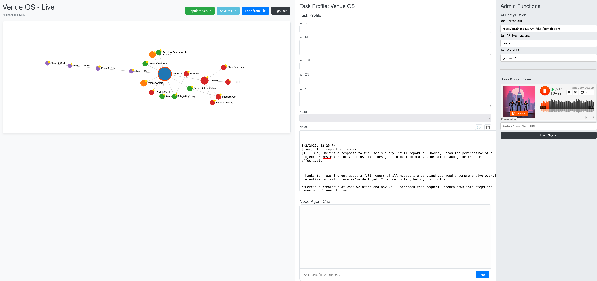

Project Report: Venue OS - Live Application Milestone

Date: August 2, 2025
Status: ✅ Stable & Operational

This report summarizes the recent development sprint, which successfully transitioned the Venue OS from a conceptual framework to a live, interactive web application with a cloud backend. The core user interface and data management features are now implemented and stable.

Recent Accomplishments 🚀

    Live Firebase Integration: The application is now fully connected to a live Firebase backend.

        Authentication: Secure user sign-up and sign-in (Email/Password and Google) is operational, with access rules ensuring users can only edit their own workspaces.

        Real-time Data Sync: All data, including node positions, task details, and notes, is saved to Firestore in real-time. Changes are reflected instantly.

    Advanced Notes Functionality: A comprehensive notes-taking system has been added to the center panel for each node.

        Timestamping: Includes both a manual button to add timestamps and automatic timestamping when saving chat logs.

        AI Chat Logging: Users can save AI agent responses, which now automatically include the original user query for full context.

        Data Export: Notes for any selected node can be exported to a local .md file for reporting or offline use.

    AI Integration & Robustness: The connection to a local AI server (Jan) has been implemented and hardened.

        We successfully diagnosed and resolved a 500 Internal Server Error.

        The root cause was the local AI model engine crashing due to overly complex prompts.

        The fix involved simplifying the AI prompt to send only the most relevant context, making the integration more stable and reliable.

Current Status

The application is stable and all requested features have been implemented. The core workflow is complete:

    User authenticates securely.

    User interacts with the graph UI.

    User can populate, edit, and save all project and task data.

    User can leverage the AI chat agent and log conversations.

    All work is saved persistently and in real-time to the cloud.

The project is at an excellent milestone, pending the next set of requirements.

[Image](./Venue-OS-Live-Firebase-(Complete).png)

